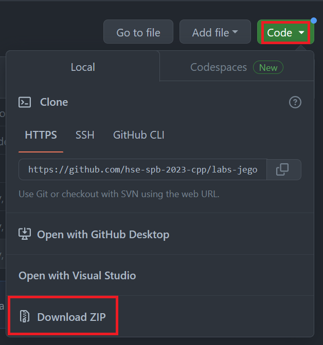
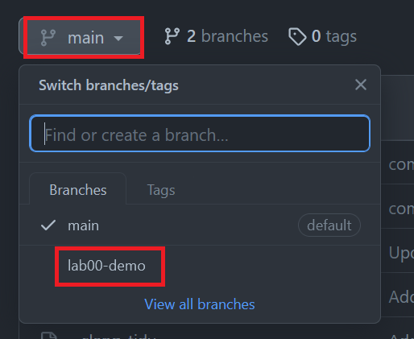
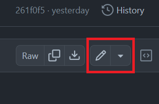
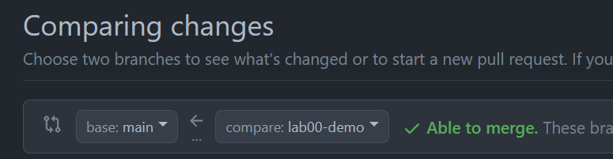

# Про сдачу домaшки:

Для сдачи используем гитхаб.
Вам всем выдан доступ к организации `hse-spb-2023-cpp`, в ней для каждого создан репозиторий
с названием `labs-*ваш ник на гитхабе*`.
Если вы не можете его найти, убедитесь что вы авторизованы в гитхабе с тем же логином, что сообщили в опросе перед учебой 
и что вы приняли приглашение, которое было выслано вам на почту. 

## Если вы не хотите использовать консольный git:

* Откройте свой репозиторий и скачайте всё его содержимое (ветки main или ветки с текщей лабой) в виде архива

* Разархивируйте его и напишите код/измените имеющийся
* Откройте ветку с текущей лабой:

* Найдите на гитхабе файл, который хотите изменить и откройте его. Затем нажмите на иконку "редактировать" в правом верхнем углу

* в открывшееся окошко скопируйте измененный код и нажмите кнопку "commit changes". Убедитесь, что 
в открывшемся окошке выбрана опция `Commit directly to the lab*номер*-*название* branch` и подтвердите коммит. 
(Гитхаб имеет дурную привычку сбрасывать текущую ветку на main)

Через web-интерфейс можно менять файлы только по одному.

## Если вы хотите пользоваться консольным гитом. 

Для сдачи первых лаб должно хватить пяти команд:

* `git clone *ссылка https/ssh*` - создаст у вас на компьютере локальную копию репозитория
* `git branch *имя етки*` - переключает ветки
* `git clone *имя файла*` - добавит файл в индекс/изменит в нём текущую версию на содержимое файла
* `git commit -m "*название коммита*"` - добавит новый коммит со всеми добавленными через `add` изменениями
* `git push` - отправит ваш коммит на сервер (на самом деле вмержит ту версию, что у вас локально в ту, что на сервере)

После того как вы добавили коммит в ветку с лабой во вкладке actions будут видны результаты прохождения этим коммитом 
тестов. В качестве сданного дз принимаются только те, что прошли все тесты.

## Создание pull request

Pull request - инструмент гитхаба созданный для того, чтобы предлагать свои изменения на рассмотрение в публичные проекты. Мы 
используем его не совсем по назначению - вы предлагаете изменения из ветки `lab-**`  в ветку `main`. Во вкладке `pull requests`
нажимате кнопку `new pull request`, далее выбираете откуда и куда будет ваш pull request

В качестве названия pull request пишете `ФИО, lab*номер*-*название*` и нажимете `Create pull request`. 
После этого на страницу pull request-а придёт yeputons-bot и проверит его корректность. Если вы исправили 
его замечания (убрали лишнее из ветки `main` и т.д.), а бот не пришёл снова - поменяйте туда-обратно название pull request-а 

Условия сдачи ДЗ - зелёная галочка от yeputons-bot и на последнем коммите в ветке в actions

После того, как вы создали pull request можно добавлять новые коммиты и они будут видны в текущем реквесте. Таким 
образом на однулабу нужен один реквест

## про тесты
Для запуска тестов на сервере запускается скрипт `run-test-data.sh`, он виден вам из всех веток.
Его можно запустить и локально, передав первым аргументом имя исполняемого файла, который вы скомпилировали 
из своих исходников 

Под линуксом (и, скорее всего, Mac-ом) для этого нужно просто ввести в терминал
`./run-test-data.sh ./overview` или `bash run-test-data.sh ./overview` (Если у вас не хватает прав для запуска скрипта - 
воспользуйтесь `chmod`)

Под windows можно:
* установить консольный git. С ним в комплекте идет `git bash`, которым можно запустить скрипт так же как обычным
* запустить под WSL. При этом возможен спецэффект - файл непраивльно прочитаются из-за разных переводов строк под 
виндрой и линуксом. В таком случае пропустите все файлы с тестами через `dos2unix`

Данные тестов лежат в папке `test-data`: `*.in` - входные `*.sol` - возмодгые ответы. Иногда корректность
ответов дополнительно проверяется чекером на питоне.

Скрипт запускает только те тесты, название которых указано в `tests.txt`. Редактируя этот файл можно добавлять и убирать их.
Полный список тетсов всегда остаётся в ветке `main`

 

